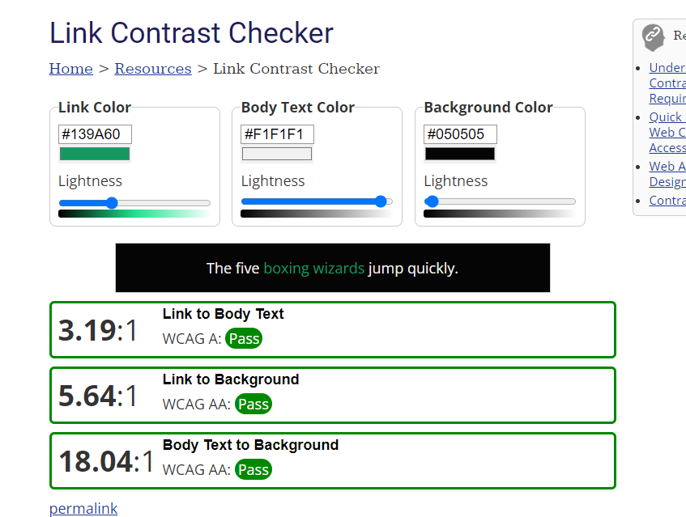
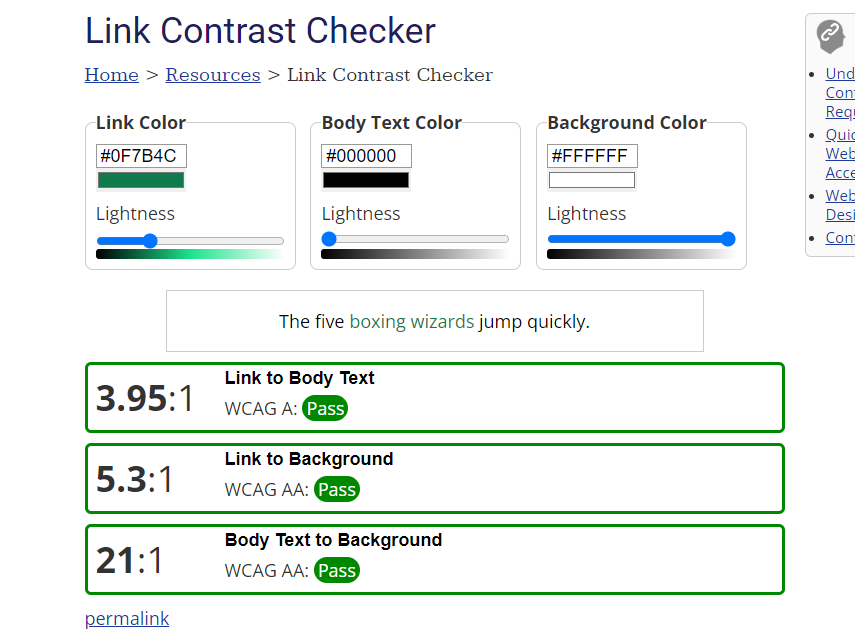
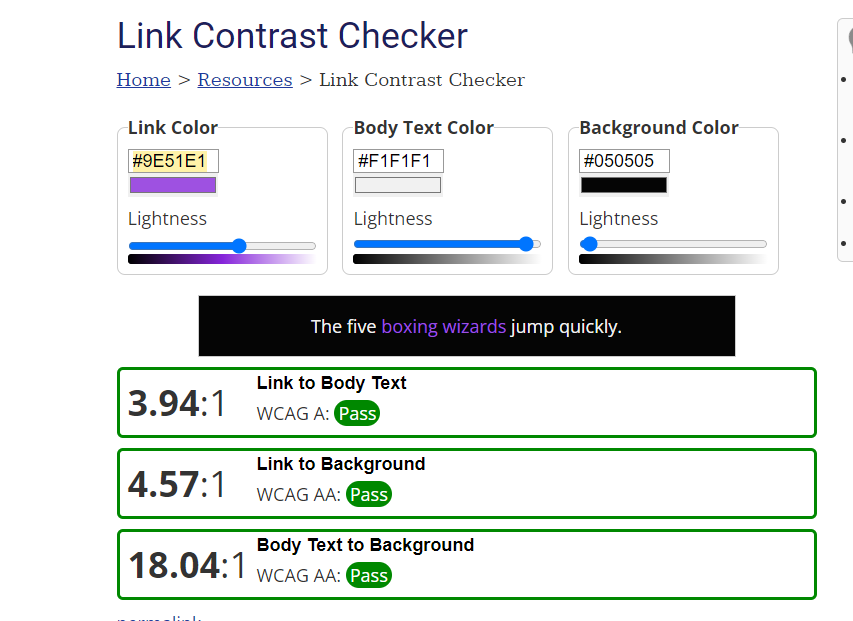
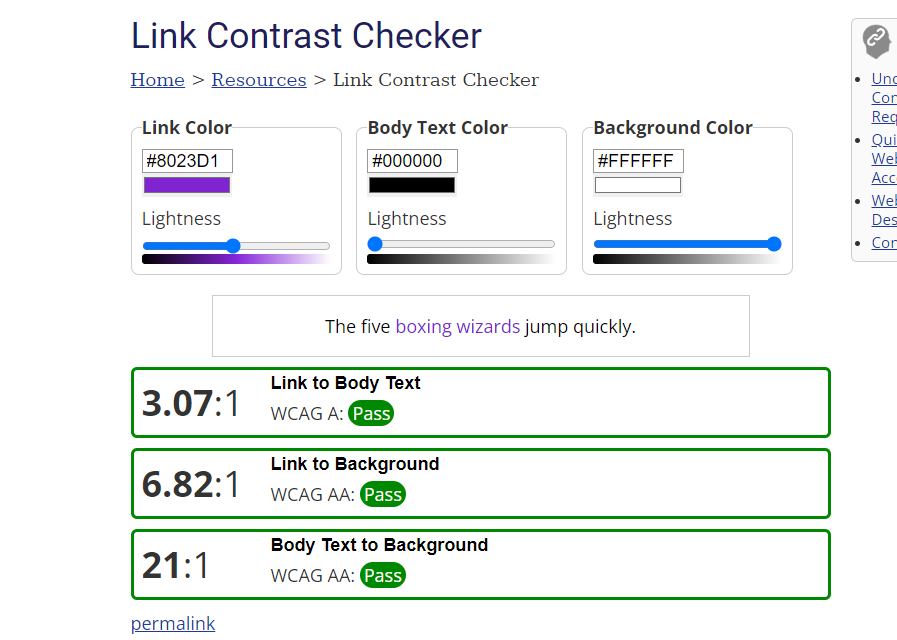

# Regole e contrasti

For usability and accessibility, links should be underlined by default. Otherwise, [link text must have at least 3:1 contrast with surrounding body text](https://webaim.org/articles/contrast/#only), and must present a non-color indicator (typically underline) on mouse hover and keyboard focus. (abbiamo abbastanza contrasto per non mettere la sottolineatura)

In addition, both links and body text must have at least 4.5:1 contrast with the background (3:1 for large text) to meet WCAG 2 Level AA.

*link color nero*

*link color bianco*

Link visited contrast

*link visited color nero*

*link visited color bianco*

## Norme

Norme menù:
    - Normal: Colore del testo uguale al colore del link, no padding background.
    - Visited: Colore del link come colore del link visitato, no padding background.
    - Active: Colore testo come background e colore padding come colore link.
Norme bottoni:
    - Colore testo: Come il colore del testo nel body
    - Hover: Colore dei link.
